# ZEMA

**TEKNOFEST rapor değerlendirmelerini destekleyen AI sistemi.**
T3 Vakfı Bursiyer Yapay Zeka Creathonu — Problem 4.

> **AI karar vermez, hakemi hızlandırır.**
> Her AI çıktısı bir *öneri*dir. Hakem onaylar, düzenler veya reddeder.
> Onaylanmayan hiçbir metin yarışmacıya ulaşmaz.

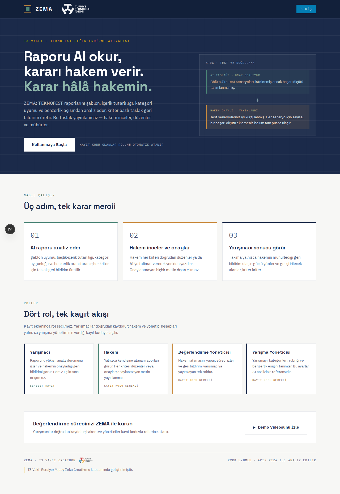

---

## Ne yapıyor

Bir rapor yüklendiğinde sekiz kontrol otomatik çalışır (bkz. [AI Kontrolleri](#sekiz-ai-kontrolü)):
zorunlu başlıklar, şablon uygunluğu, dil kalitesi, başlık-içerik tutarlılığı,
kategori uygunluğu, benzerlik/özgünlük, rubrik bazlı kriter değerlendirmesi ve
bunların hepsini tek bir metinde toplayan AI değerlendirme özeti.

Sonuçlar hakeme *taslak* olarak gösterilir. Hakem her kriteri düzenleyip
mühürler; Değerlendirme Yöneticisi geri bildirimi yayımlar; yarışmacı yalnızca
yayımlanan sürümü görür.

## Nasıl çalışır

1. **AI raporu analiz eder** — şablon uyumu, başlık-içerik tutarlılığı, kategori
   uygunluğu ve benzerlik oranı taranır; her kriter için taslak geri bildirim
   üretilir.
2. **Hakem inceler ve onaylar** — hakem her kriteri doğrudan düzenler ya da
   AI'ye talimat vererek yeniden yazdırır. Onaylanmayan hiçbir metin dışarı
   çıkmaz.
3. **Yarışmacı sonucu görür** — takıma yalnızca hakemin mühürlediği geri
   bildirim ulaşır: güçlü yönler ve geliştirilecek alanlar, kriter kriter.

Kayıt ekranında rol seçilmez. Yarışmacılar doğrudan kaydolur; hakem ve
yöneticiler yalnızca yarışma yönetiminin verdiği kayıt koduyla açılır.

## Roller ve Ekranlar

ZEMA'da dört rol var; her biri girişten sonra tamamen farklı bir ekran
kümesiyle karşılaşır. Aşağıda her rol için "bu rolde giriş yapınca ne
görürüm, ne yapabilirim" sorusunun cevabı, ekran görüntüleriyle birlikte.

### Yarışmacı

Raporunu yükler, analiz durumunu izler, yalnızca hakemin onayladığı geri
bildirimi görür. **Ham AI çıktısına hiçbir zaman erişemez** — bu RLS
seviyesinde garanti edilir (bkz. [Güvenlik modeli](#güvenlik-modeli)).

- **`/submissions` — Raporlarım.** Katıldığı her takım/yarışma için bir kart:
  rapor durumu (`TAMAMLANDI`, `ANALİZ TAMAM`, …), geri bildirim hazır mı
  rozeti, son başvuru tarihi. "Yeni rapor yükle" butonuyla yeni bir teslim
  başlatır.

  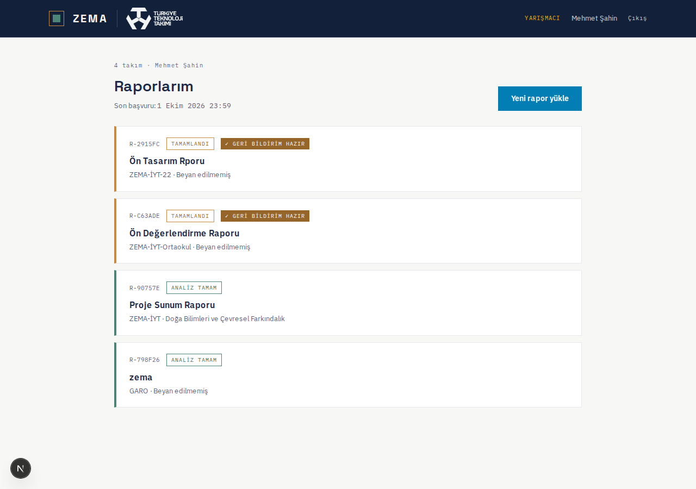

- **`/submissions/new` — Rapor yükleme.** PDF seçer, hangi kategoriye
  başvurduğunu seçer. Yarışma birden fazla aşamalıysa (örn. Ön Tasarım →
  Kritik Tasarım → Final) bir **aşama seçici** de çıkar; tek aşamalı
  yarışmalarda bu adım hiç gösterilmez, tek aşamaya otomatik düşülür. Aynı
  takım aynı yarışmanın aynı aşamasına ikinci kez rapor yükleyemez.
- **`/submissions/[id]` — Rapor detayı / geri bildirim.** Rapor henüz
  değerlendirilmediyse durum bilgisi; hakem onaylayıp Değerlendirme Yöneticisi
  yayımladıysa **nihai geri bildirim**: özet, güçlü yönler, geliştirilecek
  alanlar (öncelik etiketiyle), sonraki adımlar. Puan veya ham AI metni asla
  görünmez — yalnızca hakemin son onayladığı yapıcı metin.

  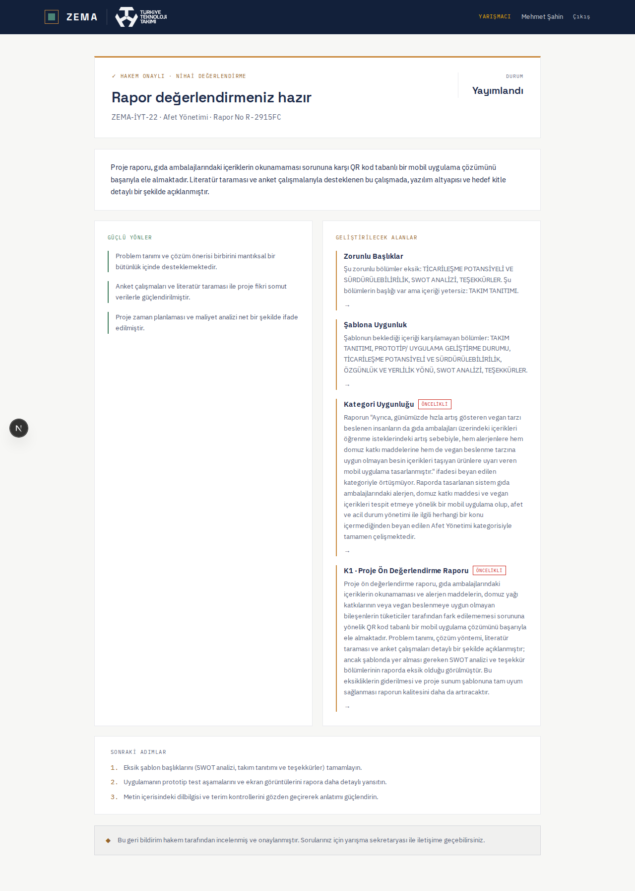

### Hakem

Yalnızca kendisine **atanmış** raporları görür (Değerlendirme Yöneticisi
atar). Her kriteri düzenler veya onaylar; onaylanmadığı sürece hiçbir metin
yarışmacıya gitmez.

- **`/review` — Atanan raporlarım.** Sol tarafta rapor kanadına/kategoriye
  göre gruplu liste, her raporun kaç kriterinin onaylandığı ve "DİKKAT"
  rozetiyle en yüksek öncelikli sorun.
- **`/review/[id]` — Rapor inceleme.** Üstte özet şerit: rapor başlığı, en
  yüksek benzerlik yüzdesi, onaylanan kriter sayısı, "Onayla ve Gönder"
  butonu.

  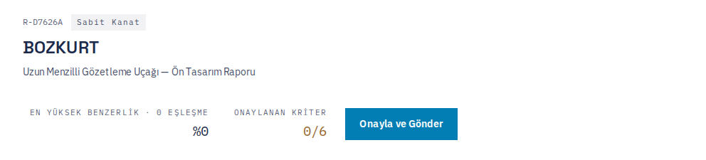

  Altında sekiz kontrolün akordeon listesi (`AI KONTROLLERİ · 7/7` —
  sekizincisi, AI Değerlendirme Özeti, ayrı kutuda). Renk kodu sabit:
  **yeşil** = uygun, **turuncu** = dikkat, **kırmızı** = uygun değil. Liste
  kapalıyken her kontrolün adı, yüzdesi ve rozeti tek bakışta görünür; sistem
  en sorunlu kontrolü sayfa açılır açılmaz otomatik genişletir.

  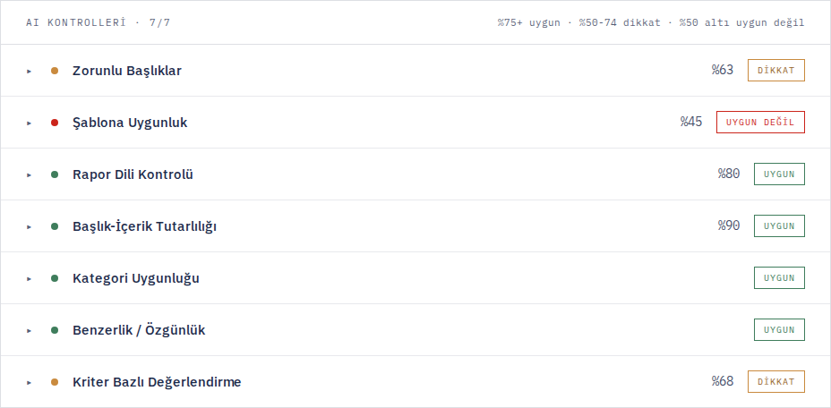

  Bir kontrole tıklandığında tam gerekçesi, rapordan **birebir doğrulanmış
  alıntılar** ve varsa yarışmacıya gidecek "Hakem Geri Bildirimi" kutusu
  açılır (bu kutu AI'nin taslağıyla ön dolu gelir, hakem serbestçe
  değiştirir). Aşağıda "Zorunlu Başlıklar" kontrolü açık örneği:

  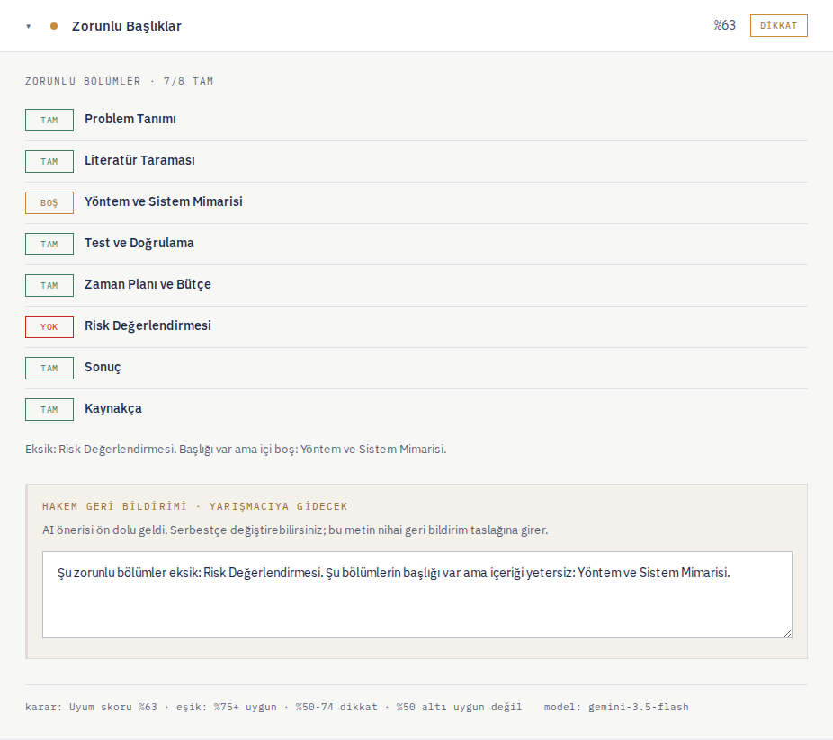

  **Kriter Bazlı Değerlendirme** panelinde rubrikteki her madde için ayrı
  bir kart vardır: AI'nin gerekçesi, doğrulanmış kanıt alıntıları, ve
  hakemin doğrudan düzenleyip "Onayla ve Mühürle" diyebileceği metin kutusu.
  İki örnek — biri "YAPILDI" (yeşil), biri "KISMEN" (turuncu) durumunda:

  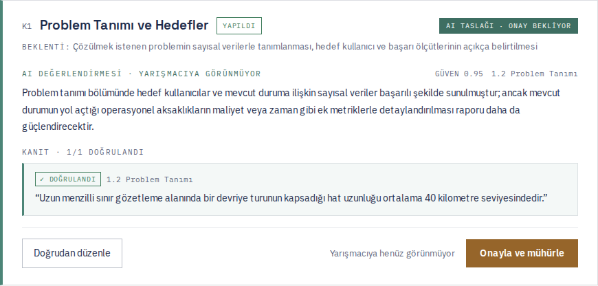

  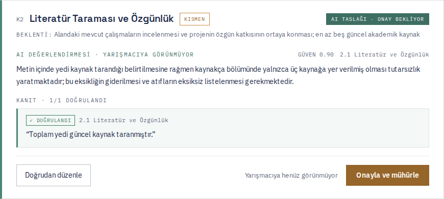

  Akordeonun altında, sekiz kontrolün tamamının otomatik derlendiği **AI
  Değerlendirme Özeti** kutusu var — özet, güçlü yönler, geliştirilecek
  alanlar ve sonraki adımlar tek bir taslakta toplanır. Bu taslak hakem
  tarafından serbestçe düzenlenebilir; yayımlama yetkisi Değerlendirme
  Yöneticisindedir.

  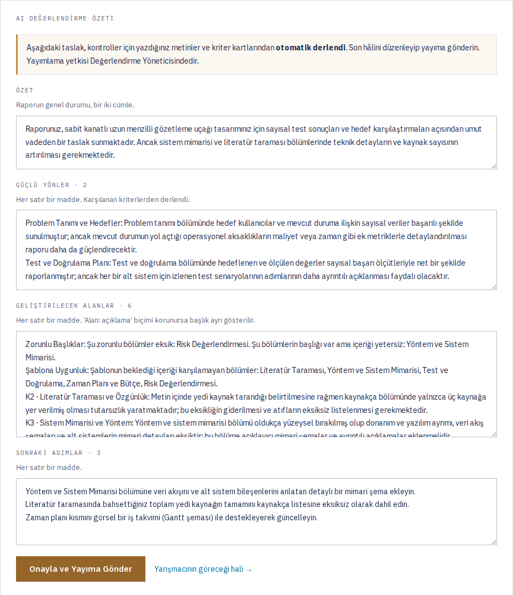
- **`/review/[id]/similarity`** — En yakın raporlarla yan yana karşılaştırma;
  hakem her eşleşme için bağımsız bir karar verir (bu artık ana inceleme
  sayfasına da gömülü olarak görünüyor, ayrı sayfaya gitmeye gerek kalmadan).

### Değerlendirme Yöneticisi

Hakem atamasını yapar, süreci izler, **geri bildirimi yarışmacıya yayımlayan
tek roldür.**

- **`/evaluation` — Değerlendirme panosu.** Yarışma seçici (birden fazla
  yarışma varsa), her raporun durumu, atanan hakem, kaç kriterin onaylandığı.
- **`/evaluation/assignments` — Hakem ataması.** Raporları hakemlere elle
  atar ya da "dengeli dağıt" ile otomatik böler; bir hakemin aşırı
  yüklenmesini önler.
- **`/evaluation/feedback/[id]` — Geri bildirim düzenleme ve yayımlama.**
  Hakemin onayladığı kriter metinlerinden ve kontrol notlarından otomatik
  derlenen taslağı gösterir: özet, güçlü yönler, geliştirilecek alanlar
  (her biri öncelik seviyesiyle ve düzenlenebilir), sonraki adımlar. Üstte
  açık bir uyarı vardır: *"Bu metin yarışmacıya aynen gidecek."* "Yarışmacıya
  Yayımla" butonuna basılmadan hiçbir şey dışarı çıkmaz; boş "güçlü yönler"
  ile yayımlamak engellenir.

  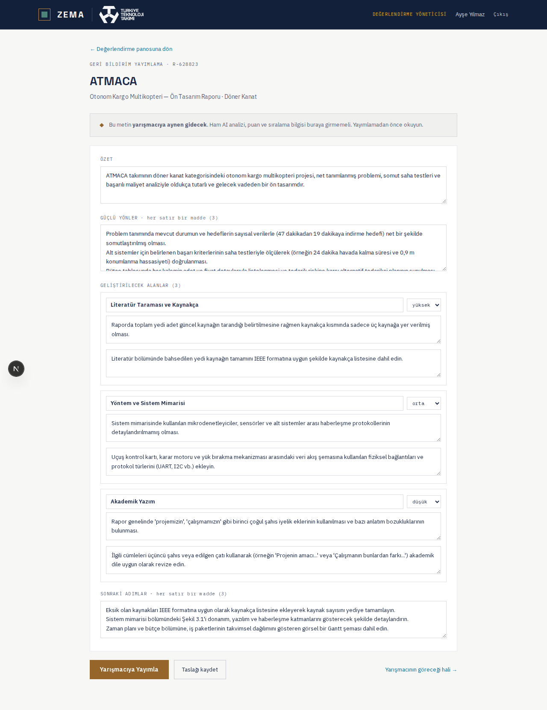

### Yarışma Yöneticisi (Admin)

Yarışmayı, kategorileri, şablonu, rubriği ve benzerlik eşiğini tanımlar. Bu
ayarlar AI analizinin **doğrudan referansıdır** — burada değişen her şey bir
sonraki analize yansır.

- **`/admin/competitions` — Yarışma bilgileri.** Ad, yıl, dil, son başvuru
  tarihi; kategori CRUD.
- **`/admin/competitions/template` — Şablon ve kriterler.** Yarışma seçici +
  **aşama seçici** ile açılır (çok aşamalı yarışmalarda her aşamanın kendi
  şablonu/rubriği olabilir; "+ Yeni Aşama" ile eklenir). Sayfa şu kartlardan
  oluşur:

  Gerçek şablon PDF'ini yükleyip AI ile çözümleme: zorunlu bölüm başlıkları,
  biçim kuralları (yazı tipi, sayfa sınırı, hizalama, altbilgi) otomatik
  çıkarılır.

  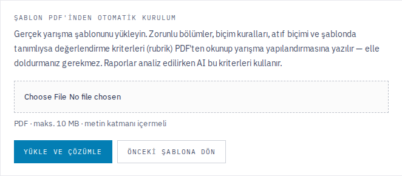

  Şartname (yarışma kuralları) PDF'ini ayrıca yükleyip **değerlendirme
  kriterlerini (rubrik)** çıkarma — puanlama çoğu yarışmada şablonda değil,
  şartnamede bulunduğu için ayrı bir kaynak.

  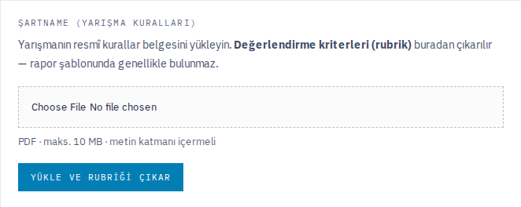

  Zorunlu bölüm başlıklarını elle ekleme/silme, biçim kurallarının özeti:

  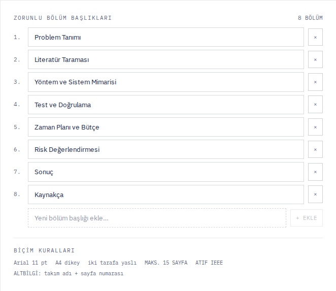

  Değerlendirme kriterlerini elle ekleme/düzenleme/silme, her kriterin ağırlık
  yüzdesi:

  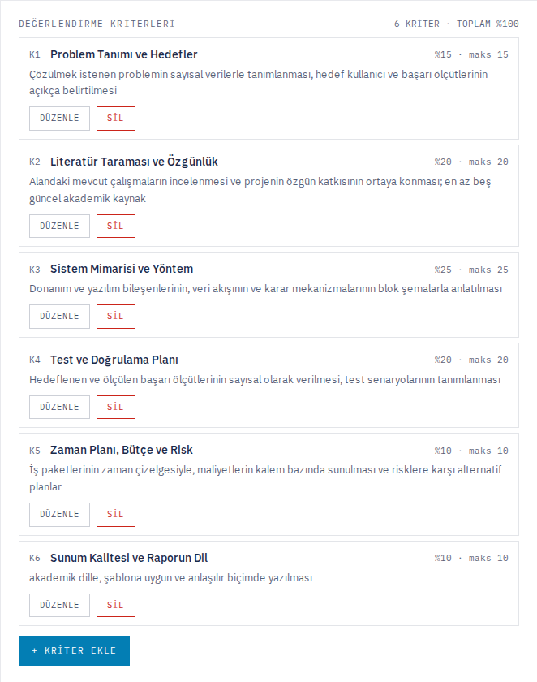

  Ayrıca bir benzerlik eşiği kaydırıcısı var (bu yüzdenin üzerindeki raporlar
  hakeme "dikkat çekici" işaretlenir). En altta **yarışma onayı**:
  yayımlanmadığı sürece yarışmacılar yarışmayı hiç göremez; "Yayında" /
  "Yayından Kaldır" tek tıkla değişir (kaldırırken onay istenir).

  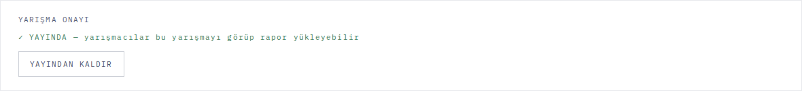

## Sekiz AI kontrolü

| Kontrol | Ne bakıyor |
|---|---|
| **Zorunlu Başlıklar** | Şablonun istediği bölüm başlıkları raporda gerçekten var mı (yalnızca varlık) |
| **Şablona Uygunluk** | Raporun İÇERİĞİ, şablonun her başlık altında istediğiyle örtüşüyor mu + ölçülen biçim kuralları (yazı tipi, sayfa sınırı, hizalama, altbilgi) |
| **Rapor Dili Kontrolü** | Dil/yazım kalitesi, sayfa numarası referanslı hata listesi |
| **Başlık-İçerik Tutarlılığı** | Başlığın vaat ettiği ile içeriğin gerçekten örtüşmesi |
| **Kategori Uygunluğu** | Beyan edilen kategori içerikle uyumlu mu |
| **Benzerlik / Özgünlük** | Diğer raporlarla metin örtüşmesi (iki aşamalı: Postgres trigram ön eleme → model) |
| **Kriter Bazlı Değerlendirme** | Rubrik maddesi başına, kanıt alıntılı puanlama |
| **AI Değerlendirme Özeti** | Yukarıdaki yedi kontrolün sentezi — yarışmacıya gidecek özet, güçlü yönler, geliştirilecek alanlar, sonraki adımlar |

İlk üçü eskiden tek bir "Dil ve Şablon Uyumu" kontrolüydü; hakem geri
bildirimiyle üçe bölündü çünkü tek kontrol hem başlık varlığını, hem içerik
uyumunu, hem dil kalitesini karıştırıyordu.

## Halüsinasyona karşı ne yapıyor

Modelin verdiği her kanıt alıntısı, rapor metninde **birebir** geçtiği kodla
doğrulanır. Üç sonuç ayırt edilir:

- **birebir bulundu** → kanıt geçerli
- **yalnızca diyakritikler katlanınca bulundu** → alıntı doğru ama yazım bozuk
- **bulunamadı** → kırmızı rozet, ve o kriterin `confidence` değeri düşürülür

Alıntı hiç verilmemişse ceza yoktur — model kanıt gösteremediğini dürüstçe
bildirmiş olabilir. Ceza, kanıt *iddia edip* doğrulanamayana verilir.

Canlı veride (kriter bazlı değerlendirme, tüm raporlar) ölçülen sonuç:
**77 alıntının 76'sı birebir doğrulandı** — doğrulanamayan tek alıntı
kırmızı rozetle işaretlenip güven skorunu düşürdü, sessizce geçmedi. Sayı
kasıtlı olarak "%100" değil: mekanizmanın gerçekten çalıştığının kanıtı,
hiç yakalamaması değil en az bir gerçek sapmayı yakalamış olmasıdır.

## Mimari / Teknik Altyapı

```
Yarışmacı → PDF → Supabase Storage
                       │  unpdf ile metin çıkarımı
                       ▼
              reports · analysis_jobs (8 satır)
                       │
        POST /api/jobs/tick  ← client-side polling (yükleme sonrası
        claim_analysis_jobs()   döngü + rapor ekranı açıkken periyodik)
        FOR UPDATE SKIP LOCKED
                       │  her iş = 1 model çağrısı
                       ▼
     analysis_results · ai_criterion_scores · similarity_pairs
                       │
     Hakem paneli   Değ. Yön. panosu   Yarışmacı geri bildirimi
```

**Neden kuyruk:** Sekiz kontrolü tek HTTP isteğinde çalıştırmak serverless süre
limitine takılır. Kuyruk ayrıca *kısmi sonuç* sağlıyor — birkaç kontrol
bitince hakem onları görmeye başlıyor. `SKIP LOCKED` iki eşzamanlı tick'in
aynı işi iki kez çalıştırmasını (ve iki kez kota harcamasını) engelliyor.
5 dakikadan eski `running` işler (çökmüş bir işlem varsayımıyla) otomatik
yeniden kapılabilir hale gelir.

**Tick nasıl tetikleniyor:** `POST /api/jobs/tick` her çağrıda kuyruktan
**tek** iş kapar, çalıştırır, sonucu yazar, döner. Client bunu (a) rapor
yüklendikten hemen sonra kısa aralıklarla, (b) hakem/yarışmacı rapor ekranı
açıkken periyodik olarak, (c) yedek olarak Vercel Cron ile çağırır. Tek iş
işlenmesinin sebebi: serverless fonksiyon süre sınırı (`maxDuration=60`) —
ağır bir kontrol (çok-modlu PDF + büyük şablon metni) tek başına onlarca
saniye sürebiliyor, iki işi art arda koymak platformun kendi zaman aşımına
çarpıp işi temiz bir hata almadan `running` durumunda asılı bırakabiliyordu.

**Model + anahtar fallback zinciri:** Ücretsiz katman kotası **model × proje
başına günde 20 istek**. Birden fazla Google AI Studio projesinden anahtar
eklenip havuzlanıyor (`GOOGLE_API_KEY`, `GOOGLE_API_KEY_1..10`). Bir çağrı
başarısız olduğunda:

- **429 (kota doldu)** → o (model, anahtar) çifti soğumaya alınır, **aynı
  modelin sıradaki anahtarı** denenir (anahtar-öncelikli, modelden düşmek
  son çare — kalite korunur).
- **5xx (aşırı yük, 504 dahil) veya ağ/zaman aşımı hatası** → aynı şekilde
  sıradaki model/anahtara geçilir; her denemenin süresi ve tüm zincirin
  toplam süresi ayrı ayrı sınırlanmıştır (fonksiyon süre limitinin güvenle
  altında kalmak için).
- **400 (geçersiz anahtar)** → o anahtar kalıcı olarak elenir (tek bozuk
  anahtar tüm zinciri düşürmesin diye).
- **403 (anahtar geçici erişilemez — proje yeni etkinleştirilmiş olabilir)**
  → yalnızca o anahtar kısa süreliğine elenir, kalıcı değil.

**Stack:** Next.js 16 (App Router) · Supabase (Postgres/Auth/Storage) ·
Google Gemini API · Vercel · Tailwind v4 + shadcn/ui

## Güvenlik modeli

Erişim kontrolü **Postgres tarafında RLS ile** uygulanıyor, uygulama katmanında
filtreleme ile değil. Bir kullanıcının görmemesi gereken satır sorgudan hiç
dönmüyor.

- **Yarışmacı** ham AI analizini göremez (`analysis_results`,
  `ai_criterion_scores` → 0 satır). Yalnızca yayımlanmış `feedback` satırı.
- **Hakem** yalnızca kendisine *atanmış* raporu görür ve yalnızca ona müdahale
  edebilir.
- **Yayımlama** yetkisi tek roldedir: Değerlendirme Yöneticisi.
- Bir yarışma **yayımlanmadan** yarışmacılar onu hiç göremez — bu da RLS
  politikasının bir parçası (`is_published = true OR auth_is_staff() OR
  auth_role() = 'judge'`), sayfa seviyesinde ayrı bir kontrol değil.
- Mutasyon yapan server action'ların hepsinde ayrıca rol kontrolü var — bir
  kısmı `service_role` kullandığı için RLS orada tek başına kalkan değil
  (iki katmanlı savunma: RLS birincil, uygulama katmanı ikincil).
- Roller kayıt ekranında **seçilmez**. Yarışmacı serbest kaydolur; diğer üç rol
  yalnızca doğru kayıt koduyla açılır. Kodlar sunucuda kalır, istemciye
  yalnızca atanacak rolün *adı* döner.

## Kurulum

```bash
npm install
cp .env.example .env.local     # değerleri doldur (aşağıya bak)
```

Supabase SQL Editor'de sırayla çalıştır:

```
supabase/migrations/0001_init.sql             şema (16 tablo, 8 enum)
supabase/migrations/0002_rls.sql              49 RLS politikası, 5 yardımcı fonksiyon
supabase/migrations/0003_grants.sql           API rollerine GRANT + RLS güvenlik kilidi
supabase/migrations/0004_claim_jobs.sql       kuyruk ve benzerlik ön eleme fonksiyonları
supabase/migrations/0005_not_null_fks.sql     yabancı anahtar bütünlüğü
supabase/migrations/0006_judge_notes.sql      hakem notu kolonu
supabase/migrations/0007_competitions_created_at.sql
supabase/migrations/0008_teams_founded_year.sql
supabase/migrations/0009_one_entry_per_team.sql   takım+yarışma tekillik kuralı
supabase/migrations/0010_report_stages.sql    çok aşamalı rapor desteği (ÖTR/KTR/Final)
supabase/migrations/0011_competition_published.sql   yarışma onayı/yayım kapısı
supabase/migrations/0012_check_type_values.sql    ⚠️ önce bu, AYRI çalıştır
supabase/migrations/0013_check_types_split.sql    ⚠️ sonra bu, AYRI çalıştır
```

> `0012` ve `0013` birbirine bağımlı ama **aynı transaction'da çalıştırılamaz**
> (Postgres yeni enum değerini eklendiği transaction içinde kullanmaya izin
> vermiyor) — SQL Editor'de iki ayrı "Run" olarak çalıştırın.

Sonra:

```bash
npm run seed          # yarışma, kategoriler, rubrik, 4 rol için test hesabı
npm run demo:seed     # demo raporları üret + yükle + kuyruğa al
MOCK_AI=false npm run demo:analyze   # kuyruğu GERÇEK modelle boşalt
npm run dev
```

### Ortam değişkenleri

`.env.example` tüm anahtar adlarını içerir. Kritik olanlar:

| Değişken | Not |
|---|---|
| `NEXT_PUBLIC_SUPABASE_URL` · `..._ANON_KEY` | Supabase → Project Settings → API |
| `SUPABASE_SERVICE_ROLE_KEY` | **sunucu tarafı**, RLS'i baypas eder |
| `GOOGLE_API_KEY` | aistudio.google.com/apikey (ücretsiz) — **sunucu tarafı** |
| `GOOGLE_API_KEY_1..10` | ek anahtar havuzu. Kota model × **proje** başına günde 20 istek; farklı AI Studio projelerinden anahtar eklemek kotayı toplar |
| `GEMINI_MODEL` | `gemini-3.5-flash` |
| `GEMINI_MODEL_CHAIN` | 429/5xx'te denenecek model sırası |
| `MOCK_AI` | **varsayılan `true`** — env unutulursa gerçek API çağrılmaz |
| `REGISTRATION_CODE_*` | üç rol için kayıt kodu. Gerçek değerler repoya girmez |
| `NEXT_PUBLIC_DEMO_MODE` | `/demo` rol geçiş ekranını açar. Build anında okunur |

**Hakem veya yönetici hesabı gerekiyorsa proje sahibinden kayıt kodu isteyin.**

### `MOCK_AI` bir güvenlik/kota kontrolüdür

`MOCK_AI=true` iken gerçek API hiç çağrılmaz; her kontrol için sabit bir
fixture döner. Geliştirme boyunca açık kalmalı. Gerçek çağrı yalnızca (a) bir
kontrolü ilk kez uçtan uca test ederken, (b) deploy öncesi son doğrulamada
yapılır.

Ücretsiz katman **model başına günde 20 istek** veriyor. Sekiz kontrol ×
birkaç rapor kolayca tek modelin günlük kotasını doldurur; anahtar havuzu ve
model+anahtar fallback zinciri (bkz. [Mimari](#mimari--teknik-altyapı)) bunu
otomatik yönetir.

## Rotalar

```
/                                ana sayfa
/auth                            giriş / kayıt (kayıt kodu ile rol atama)
/gizlilik                        KVKK aydınlatma metni
/submissions · /new · /[id]      yarışmacı: rapor listesi, yükleme, geri bildirim
/review · /[id]                  hakem: atanan raporlar, kriter değerlendirmesi
/review/[id]/similarity          benzerlik detayı, yan yana karşılaştırma
/evaluation                      değerlendirme panosu
/evaluation/assignments          hakem ataması (manuel + dengeli dağıt)
/evaluation/feedback/[id]        geri bildirim düzenleme ve yayımlama
/admin/competitions              yarışma bilgileri (ad/yıl/dil/son başvuru) + kategori CRUD
/admin/competitions/template     şablon/şartname yükleme, aşama yönetimi, kriterler, yayım
/demo                            rol geçişi — navigasyonda linklenmez
/api/jobs/tick                   analiz kuyruğunu bir tur döndürür (giriş gerektirir)
/api/diagnostics/keys            anahtar havuzu sağlık kontrolü (yalnızca yarışma yöneticisi)
```

## Bilinen sınırlar

- Hakem–AI sohbeti (`correction_log` tabanlı "hafif öğrenme") iptal edildi;
  hakem aksiyonu doğrudan düzenlemeyle sınırlı.
- Rubrik ya şablon/şartname PDF'inden AI ile çıkarılıyor ya da admin
  panelinden elle girilip düzenleniyor; tamamen elle rubrik kurulumu daha
  fazla tıklama gerektiriyor.
- `/gizlilik` metni taslak; hukuki gözden geçirme gerekiyor.
- Taranmış (metin katmanı olmayan) PDF kabul edilmiyor; OCR kapsam dışı.
- Serverless fonksiyon süre sınırı (`maxDuration=60`), çok ağır çok-modlu
  kontrollerde (büyük şablon + büyük rapor PDF'i) marjı daraltıyor — bu
  yüzden tek istekte tek iş işleniyor (bkz. Mimari).

Ayrıntılı liste: [`docs/NOTES.md`](docs/NOTES.md).
Mimari kararlar ve gerekçeleri: [`docs/PLAN.md`](docs/PLAN.md).

## Gelecek sürüm

Sistemin gelecek sürümünde, geçmiş onaylı raporlar ve hakem düzeltmeleri
kullanılarak bir dil modelinin ince ayar (fine-tuning) yoluyla eğitilmesi
planlanıyor; zaman kısıtı nedeniyle bu Creathon kapsamında uygulanmadı.
